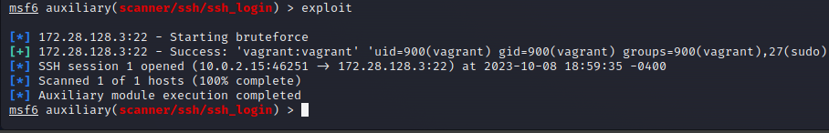

# Seguridad

Después de instalar la máquina de Kali y la máquina de Windows que hemos creado con Vagrant, seguimos estos pasos:

1. Abrimos la terminal en la máquina Kali Linux y ejecutamos el siguiente comando para entrar en la consola de Metasploit:

    msfconsole

2. Una vez en la consola de Metasploit, podemos buscar exploits utilizando el comando `search`. En este caso, queremos investigar las vulnerabilidades MS17, así que añadimos "ms17" a la búsqueda:

Observamos que hay una vulnerabilidad conocida como "eternalblue."

3. Para seleccionar esta vulnerabilidad, vemos que tiene un número asignado (por ejemplo, 0). Usamos el comando `use` seguido del número correspondiente:

    "use 0" 

4. Luego, verificamos los detalles necesarios para configurar el exploit utilizando el comando `options`. En este caso, notamos que necesitamos configurar el valor de `RHOSTS`.

5. Configuramos `RHOSTS` con la dirección IP del sistema que queremos atacar. Podemos obtener esta dirección IP utilizando `nmap`, ya que estamos en la misma red:

    set RHOSTS <dirección_IP_del_objetivo>

6. Una vez configurado `RHOSTS`, ejecutamos el exploit utilizando el comando `run` o `exploit`:

7. Después de que el exploit se complete con éxito, podemos verificar que estamos dentro del sistema de directorios de la máquina Windows utilizando el comando `pwd`.

<h2>LINUX</h2>

Para la parte de *Linux* mostraremos en 1º lugar una vulnerabilidad por la red.

1. Si entramos en un navegador y buscamos la ip de la máquina victima podemos ver que de normal tiene un listado de directorios que revela información sobre el servicio de base de datos, la máquina y el puerto usado, además de dejar opción a poder descargar cualquier archivo del servidor sin logearte.

2. Dentro de la terminal de metasploit hemos buscado algún exploit de ssh.

3. Para precisar más la busqueda hemos buscado alguno que tuviera que ver con las credenciales de inicio de sesión:

4. El exploit ssh_login del modulo scanner funciona leyendo un fichero de texto con los nombre de los usuarios y otro fichero que almacena posibles contraseñas (Son obligatorios para la ejecución del escaner). Ademas de colocar en el RHOSTS la ip de nuestra victima.

5. Podemos observar como nos muestra por pantalla el usuario y la contraseña de dicho usuario.

